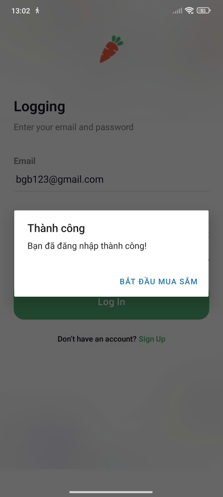
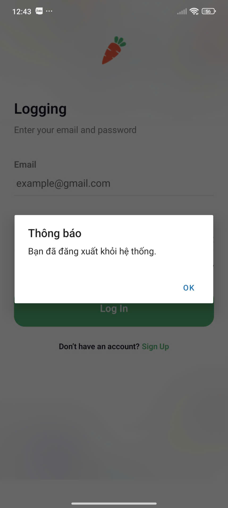
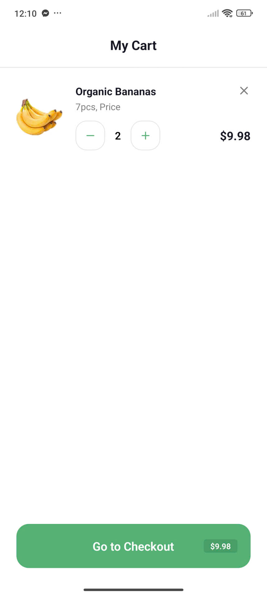
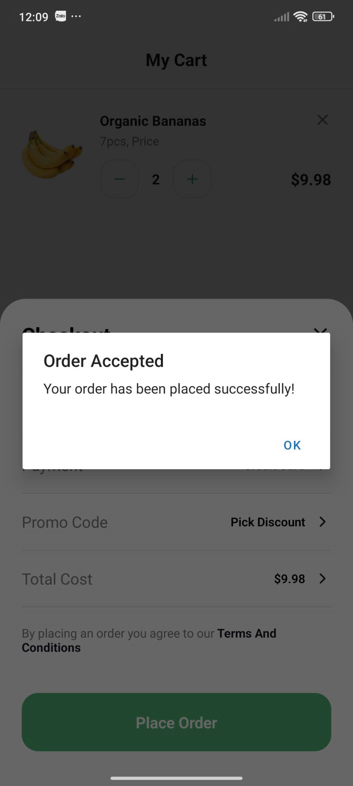
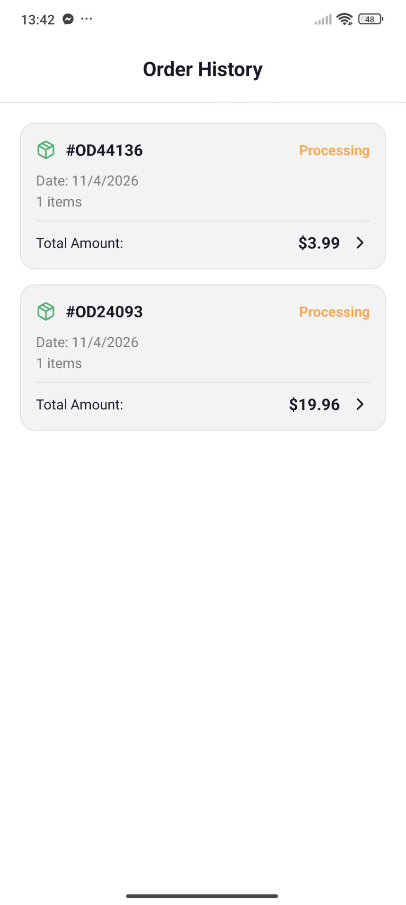

# Bài Thực Hành 01: Nectar-App - Mobile Application

## Thông tin sinh viên
* **Họ và tên:** Bạch Gia Bảo
* **Mã số sinh viên:** 23810310340

---

## 1. Mô tả chức năng
Ứng dụng Nectar-App là một nền tảng thương mại điện tử mua sắm thực phẩm sạch, bao gồm các tính năng chính sau:

* **Đăng nhập & Xác thực:** Hỗ trợ đăng nhập người dùng và duy trì trạng thái đăng nhập (**Auto Login**) khi khởi động lại ứng dụng.
* **Duyệt sản phẩm:** Hiển thị danh sách sản phẩm theo danh mục (Trái cây, Đồ uống, Thực phẩm từ sữa...).
* **Quản lý Giỏ hàng:**
    * Thêm sản phẩm vào giỏ hàng.
    * Thay đổi số lượng (Tăng/Giảm) trực tiếp trong giỏ hàng.
    * Xóa sản phẩm khỏi giỏ hàng.
    * Tự động lưu trạng thái giỏ hàng ngay cả khi reload app.
* **Thanh toán (Checkout):** Quy trình xác nhận đơn hàng và tổng chi phí.
* **Lịch sử đơn hàng (Order History):**
    * Lưu lại danh sách các đơn hàng đã đặt thành công.
    * Dữ liệu đơn hàng được lưu trữ bền vững (Persistence) qua **AsyncStorage**.

---

## 2. Hướng dẫn chạy App

Để chạy ứng dụng này trên máy cục bộ, hãy làm theo các bước sau:

1.  **Cài đặt môi trường:** Đảm bảo đã cài đặt Node.js và các công cụ Expo CLI.
2.  **Clone source code:**
    ```bash
    git clone [Link-repository-cua-ban]
    cd Nectar-App
    ```
3.  **Cài đặt thư viện:**
    ```bash
    npm install
    # hoặc
    yarn install
    ```
4.  **Khởi động ứng dụng:**
    ```bash
    npx expo start
    ```
5.  **Chạy trên thiết bị:** Sử dụng ứng dụng **Expo Go** (Android/iOS) quét mã QR hoặc chạy trên trình giả lập (Simulator/Emulator).

---

## 3. Kết quả (Demo Screenshots)











[](https://youtube.com/shorts/pX3DsTlC6V8)

---

## 4. Trả lời câu hỏi lý thuyết

### 1. AsyncStorage hoạt động như thế nào?
* **Cơ chế:** Là hệ thống lưu trữ dữ liệu kiểu **Key-Value**, không quan hệ, lưu dữ liệu trực tiếp vào bộ nhớ thiết bị.
    * **iOS:** Sử dụng các file riêng biệt hoặc UserDefaults.
    * **Android:** Sử dụng SQLite hoặc RocksDB.
* **Tính bất đồng bộ:** Mọi thao tác (đọc/ghi) đều trả về một **Promise**, giúp tránh việc nghẽn luồng xử lý giao diện (UI Thread).
* **Kiểu dữ liệu:** Chỉ chấp nhận kiểu **String**. Muốn lưu Object/Array cần dùng `JSON.stringify()` và `JSON.parse()`.

### 2. Vì sao dùng AsyncStorage thay vì State?
* **State (Trí nhớ tạm):** Chỉ tồn tại trên RAM khi ứng dụng đang chạy. Dữ liệu sẽ mất sạch khi tắt app, khởi động lại máy hoặc app bị crash.
* **AsyncStorage (Lưu trữ bền vững):** Dữ liệu được ghi xuống bộ nhớ vật lý của máy. Giúp duy trì dữ liệu người dùng (như Token, Giỏ hàng, Cài đặt) qua nhiều lần sử dụng.

### 3. So sánh Context API và AsyncStorage
| Tiêu chí | Context API | AsyncStorage |
| :--- | :--- | :--- |
| **Mục đích** | Chia sẻ dữ liệu giữa các Component | Lưu trữ dữ liệu lâu dài trên máy |
| **Vị trí lưu** | Bộ nhớ tạm (RAM) | Bộ nhớ máy (Disk) |
| **Tốc độ** | Rất nhanh | Chậm hơn (do truy xuất ổ cứng) |
| **Khi tắt app** | Dữ liệu bị xóa sạch | Dữ liệu vẫn được giữ nguyên |
| **Kết hợp** | Thường dùng để quản lý State toàn cục | Dùng làm nguồn dữ liệu "gốc" để nạp vào Context khi khởi động app |

